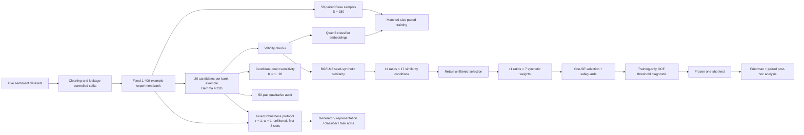

# Conditional Utility of LLM-Generated Data Augmentation for Binary Sentiment Classification Across Multiple Languages

Research code and redistribution-safe reproducibility materials accompanying the manuscript **“Conditional Utility of LLM-Generated Data Augmentation for Binary Sentiment Classification Across Multiple Languages.”**

The study asks a deliberately narrow question: when labeled real data are limited, do LLM-generated examples provide useful training information beyond the ordinary benefit of increasing training-set size? Five binary sentiment-classification settings are evaluated across English, Korean, Bengali, Hausa, and Malayalam using paired comparisons among a fixed real-only **Base**, a same-size **Matched All-real** control, and a real-synthetic **Hybrid** condition.

The primary experiment uses a common real-data base of `B = 280`, 11 augmentation ratios, 17 similarity-selection conditions, seven synthetic sample weights, and 50 paired repetitions. Dataset-specific choices are made from development data only, decision thresholds are estimated from training-only out-of-fold predictions, and the final policy is frozen before one-shot evaluation on the untouched test splits.

The revised study also includes three complementary analyses that are kept separate from primary policy selection:

- **candidate-count sensitivity**, varying the number of available synthetic candidates per seed from `K = 1` to `20`;
- a **structured qualitative audit** of 50 deterministically selected source-synthetic pairs; and
- **targeted robustness analyses** that vary the generator, downstream representation, classifier, and classification task one axis at a time under a common fixed protocol.

The frozen policy retained synthetic augmentation for English and Bengali, preserved Base for Korean and Hausa, and reverted Malayalam to Base after decision-boundary calibration removed its large fixed-threshold advantage. Bengali showed statistically reliable held-out gains in both Macro-F1 and AUROC, while English showed a reliable AUROC gain without a conclusive Macro-F1 improvement. In both augmented datasets, Matched All-real remained superior to the selected Hybrid condition. The robustness analyses further show that the magnitude, and in some settings the direction, of the augmentation effect depends on the generator, representation, classifier, and task.

## Experimental workflow



## Public repository structure

The tracked repository contains the releasable source code, rendered manuscript figures, and a curated redistribution-safe reproducibility package:

```text
Conditional-LLM-Augmentation/
├─ Sources/
│  └─ Public/
│     ├─ BinaryMatchedSizeExperiment/   # Primary pipeline, policy/test analysis, audit, sensitivity, robustness
│     ├─ Common/                        # Shared LM Studio request/model utilities
│     ├─ Data/                          # Preprocessing, manifests, and real-data reconstruction
│     ├─ Figures/                       # Figure-generation scripts for Figures 2-8
│     ├─ OffensiveLanguage/             # Task-specific offensive-language preparation/generation components
│     ├─ Pilot/                         # Prompt/output-contract pilot
│     └─ build_public_reproducibility_package.py
├─ Public/
│  ├─ Data/
│  │  ├─ Sentiment/                    # Five primary sentiment manifest bundles
│  │  └─ OffensiveLanguage/            # Five second-task manifest bundles
│  ├─ Results/
│  │  ├─ Main/                         # Primary generation and downstream numeric artifacts
│  │  ├─ CandidateCountSensitivity/v3/
│  │  ├─ QualitativeAudit/v1/
│  │  └─ Robustness/
│  │     ├─ Generator/
│  │     ├─ Embedding/
│  │     ├─ Classifier/
│  │     └─ Task/
│  ├─ DATA_REDISTRIBUTION_NOTES.md
│  ├─ PACKAGE_MANIFEST.sha256
│  └─ README.md
├─ Figures/                             # Rendered manuscript figures
├─ .gitignore
└─ README.md
```

`Sources/Public/Data/` contains the code used to prepare the datasets, construct fixed experiment banks and paired repetition records, and reconstruct the exact released real-data membership after the original datasets have been obtained locally. In particular, `reconstruct_public_experiment_data.py` verifies stable row identifiers and SHA-256 text hashes against the released text-free experiment-bank indices.

`Sources/Public/BinaryMatchedSizeExperiment/` contains the canonical primary experiment and revision-analysis code: candidate generation, Qwen3/BGE-M3 embedding, matched-size development experiments, synthetic-weight search, conservative policy freezing, decision-boundary diagnostics, frozen one-shot test evaluation, Friedman/Wilcoxon analysis, candidate-count sensitivity, qualitative audit construction, and the targeted robustness suite.

`Sources/Public/Figures/` regenerates the manuscript figures from preserved result artifacts. `Sources/Public/build_public_reproducibility_package.py` rebuilds the curated `Public/` export from a complete local research tree.

The public package intentionally does **not** redistribute third-party source text. It instead publishes stable source-row identifiers, source indices, SHA-256 text hashes, experiment manifests, exact repetition membership/order, generation plans and prompt templates, study-generated synthetic outputs, selection-audit records, and the numeric result files used for the reported analyses.

## What is released

The redistribution-safe release includes:

- preprocessing and experiment-construction code;
- text-free experiment-bank indices for the five sentiment and five offensive-language settings;
- exact paired repetition membership and ordered additional-real pools;
- stage-A generation plans and prompt templates;
- the valid synthetic outputs generated in this study for the primary experiment and released robustness generation arms;
- development-grid, weighting, policy-selection, decision-boundary, one-shot test, and rank-based statistical outputs;
- complete candidate-count sensitivity artifacts;
- targeted generator, representation, classifier, and task robustness results, including the XLM-RoBERTa-base arm;
- the deterministic 50-pair qualitative-audit release, with synthetic text and qualitative observations but without redistributing third-party source text; and
- `PACKAGE_MANIFEST.sha256` for integrity verification of the curated public package.

Excluded local/intermediate artifacts include raw third-party datasets, prepared real-text copies, embedding arrays, model caches, SQLite runtime databases, lock files tied to omitted private artifacts, raw model responses, and failure logs.

## Datasets

The primary study uses five human-annotated sentiment datasets. Labels are normalized to `0 = negative` and `1 = positive`.

| Dataset | Language setting | Resource class | Train | Development | Test |
|---|---|---:|---:|---:|---:|
| SST-2 | English | 5 | 56,927 | 10,046 | 872 |
| NSMC | Korean | 4 | 123,517 | 21,798 | 49,007 |
| CineXDrama | Bengali | 3 | 5,480 | 1,174 | 1,175 |
| HausaMovieReview | Hausa | 2 | 1,418 | 304 | 305 |
| DravidianCodeMix | Malayalam-English code-mixed | 1 | 8,079 | 1,028 | 1,033 |

The historical resource classes are descriptive only; they are not treated as an independently manipulated causal variable. Because each language setting is represented by a different dataset, the manuscript interprets cross-setting differences as **dataset-dependent heterogeneity**, not as a causal language effect.

The common preprocessing procedure applies Unicode NFC normalization, whitespace normalization, missing-value removal, exact text-label deduplication, conflicting-label removal, and cross-split leakage checks. Existing labeled holdout partitions are retained where available; newly created splits use the fixed seed `20260713`.

## Primary experimental design

A fixed experiment bank of 1,400 real examples is constructed independently for each primary dataset. Within each of 50 paired repetitions, `B = 280` examples form the Base subset and the remaining 1,120 examples form a non-overlapping additional-real pool.

```text
Base                  = B real examples
Matched All-real(r)   = B real examples + rB additional real examples
Hybrid(r)             = B real examples + rB synthetic examples
```

The 11 augmentation ratios are:

```text
0.5, 0.75, 1.0, 1.25, 1.5, 1.75, 2.0, 2.5, 3.0, 3.5, 4.0
```

Matched All-real and Hybrid share the same Base observations, total training size, and class composition within each paired repetition.

For each of the 1,400 bank examples, 20 independent generation requests are issued, yielding 28,000 requests per dataset and 140,000 requests overall. Synthetic labels are inherited from their real seeds. The primary development pipeline evaluates:

- unfiltered selection plus 16 BGE-M3 seed-synthetic cosine-similarity intervals;
- seven synthetic sample weights: `0`, `0.0625`, `0.125`, `0.25`, `0.5`, `0.75`, and `1`;
- L2-regularized logistic regression with `C = 1.0`;
- Macro-F1 at the conventional `0.5` threshold and AUROC from positive-class probabilities; and
- 50 paired repetition seeds from `1000` through `1049`.

Because no shared similarity interval consistently improved performance and restrictive intervals reduced candidate feasibility, the unfiltered condition is retained for the dataset-specific ratio-weight policy search.

## Models and representations

The primary candidate pool is generated locally through an LM Studio OpenAI-compatible endpoint using **Gemma 4 31B** (`google/gemma-4-31b`) with temperature `0.8`, top-p `0.9`, repetition penalty `1.0`, and a maximum output length of `256` tokens. The generation prompt constrains each accepted example to a single sentence of at most 30 whitespace-delimited words and a strict JSON output schema.

Two embedding models have distinct roles in the primary experiment:

- **Qwen3-Embedding-8B** produces 4,096-dimensional L2-normalized features for downstream classification.
- **BGE-M3** produces 1,024-dimensional L2-normalized representations used for seed-synthetic cosine similarity.

The code defaults to local LM Studio-compatible endpoints and exposes endpoint/model/concurrency options through the generation and embedding scripts.

## Candidate-count sensitivity

The revision analysis varies the number of available synthetic candidate slots per real seed over every integer `K = 1...20` without generating new text. Pools are nested: condition `K` uses only valid candidates from the first `K` prespecified request slots.

`K <= 3` cannot supply the largest `r = 4` condition even in principle, and `K = 4` leaves no allowance for invalid or class-short candidates. The complete unfiltered 11-ratio grid is feasible for every dataset and repetition from `K = 5` through `20`, which defines the formal repeated-measures comparison range.

Across `K = 5...20`, downstream differences from the original `K = 20` pool are generally small. No AUROC candidate-count omnibus effect is significant for any dataset; the only Holm-adjusted planned pairwise difference from `K = 20` is Hausa Macro-F1 at `K = 5`. The manuscript therefore treats 20 candidates per seed primarily as a candidate-availability design choice rather than as a performance-optimized parameter.

## Qualitative synthetic-data audit

The structured audit contains 50 source-synthetic pairs: 10 per primary dataset, balanced as five positive and five negative source labels. Selection is deterministic and performance-independent: only candidate slot `0` is considered, and source rows are ordered by a SHA-256-based rule before the first five valid examples per label are selected.

The audit distinguishes recorded label consistency from semantic label fidelity and documents observable changes in proposition, specificity, script, register, code-mixing, and sentence form. It does **not** provide numerical multilingual human-quality scores or inter-rater agreement. The public audit therefore releases the exact deterministic membership, source locators/hashes, generated text, and descriptive observations while omitting the original third-party source text.

## Frozen policy and one-shot test

The development-stage policy applies the one-standard-error rule and minimizes effective synthetic exposure `r × w`. Positive-weight candidates must also pass paired-bootstrap, neighboring-condition stability, AUROC non-inferiority, and training-only decision-boundary safeguards.

| Dataset | Frozen policy | r | w | ΔMacro-F1 at OOF threshold | ΔAUROC |
|---|---|---:|---:|---:|---:|
| English | Selected Hybrid | 3.0 | 0.75 | +0.0008 `[-0.0011, 0.0028]` | +0.0007 `[0.0006, 0.0009]` |
| Korean | Base | 0 | 0 | 0 | 0 |
| Bengali | Selected Hybrid | 4.0 | 0.50 | +0.0056 `[0.0036, 0.0076]` | +0.0022 `[0.0017, 0.0027]` |
| Hausa | Base | 0 | 0 | 0 | 0 |
| Malayalam | Base | 0 | 0 | 0 | 0 |

Values are mean paired differences from Base across 50 repetitions, with 95% paired-bootstrap confidence intervals based on 10,000 resamples.

The final Friedman and Holm-adjusted paired post-hoc analyses support a significant Selected Hybrid improvement for Bengali in both Macro-F1 and AUROC and for English in AUROC. Matched All-real significantly exceeds Selected Hybrid in both metrics for both augmented datasets. Additional real annotations therefore remain the preferred option when comparable labeled data can be obtained.

## Targeted robustness analyses

The robustness suite does not reopen the primary policy-selection search. Every arm uses the same compact fixed protocol:

```text
B = 280
r = 1
w = 1
similarity filtering = disabled
available synthetic slots per seed = first 3 prespecified slots
repetitions = 50
```

The reference arm uses Gemma 4 31B + Qwen3-Embedding-8B + logistic regression for sentiment classification. One component is then changed at a time:

| Robustness axis | Alternative setting |
|---|---|
| Generator | Qwen3.8-27B |
| Downstream representation | BGE-M3 |
| Classifier | end-to-end XLM-RoBERTa-base fine-tuning |
| Classification task | binary offensive-language detection |

The XLM-RoBERTa-base arm uses a fixed 20-epoch budget, learning rate `2e-5`, weight decay `0.01`, training batch size `16`, evaluation batch size `64`, and maximum sequence length `256`; the checkpoint with the highest development Macro-F1 is retained, with AUROC as the secondary criterion.

The second-task arm evaluates OLID (English), KOLD (Korean), TB-OLID (Bengali), HausaHate (Hausa), and the Malayalam-English offensive-language data from the DravidianLangTech/DravidianCodeMix setting. The results show that augmentation effects are not invariant to the generator, representation, downstream learner, or task and therefore should be validated in the exact pipeline in which they are intended to be used.

## Reconstructing the released real-data membership

Original third-party datasets must be obtained from the providers cited in the manuscript and placed under the paths expected by `Sources/Public/Data/prepare_datasets.py`. Then run:

```bash
py -3 Sources/Public/Data/prepare_datasets.py
py -3 Sources/Public/Data/reconstruct_public_experiment_data.py
```

The reconstruction script recomputes stable row identifiers and SHA-256 text hashes, verifies them against the released `Public/Data/Sentiment/*/experiment_bank_index.csv` files, reconstructs the exact 1,400-row primary experiment bank, and materializes the exact Base membership plus ordered non-overlapping additional-real pool for every paired repetition. Use `--expand-ratios` to materialize every Base + additional-real ratio condition explicitly.

The original source text is reconstructed only on the user's machine; it is not distributed by this repository.

## Running the code

The canonical primary/revision runner is:

```bash
py -3 Sources/Public/BinaryMatchedSizeExperiment/run_all.py --help
```

`run_all.py` verifies and preserves completed primary results, runs missing primary stages in dependency order, constructs the qualitative audit, executes candidate-count sensitivity and targeted robustness analyses, consolidates the robustness summary, and regenerates the manuscript figures. It is intentionally fail-closed around incomplete or hash-mismatched result stages rather than silently overwriting them.

Useful stage-specific entry points include:

```bash
py -3 Sources/Public/BinaryMatchedSizeExperiment/run_binary_matched_size_experiment.py --help
py -3 Sources/Public/BinaryMatchedSizeExperiment/run_binary_downstream_experiment.py --help
py -3 Sources/Public/BinaryMatchedSizeExperiment/run_binary_synthetic_weight_grid.py --help
py -3 Sources/Public/BinaryMatchedSizeExperiment/run_binary_decision_boundary_diagnostic.py --help
py -3 Sources/Public/BinaryMatchedSizeExperiment/run_binary_adaptive_one_shot_test.py --help
py -3 Sources/Public/BinaryMatchedSizeExperiment/run_candidate_count_sensitivity.py --help
py -3 Sources/Public/BinaryMatchedSizeExperiment/run_qualitative_audit.py --help
py -3 Sources/Public/BinaryMatchedSizeExperiment/run_transformer_robustness.py --help
py -3 Sources/Public/Figures/run_all.py
```

To rebuild the curated redistribution-safe export from a complete local research tree:

```bash
py -3 Sources/Public/build_public_reproducibility_package.py
```

## Local research-tree layout

The full local experiment tree contains additional untracked data and intermediate artifacts required to rerun the study:

```text
Conditional-LLM-Augmentation/
├─ Data/                                      # Local-only; excluded from Git
│  ├─ Raw/                                    # Original third-party datasets
│  ├─ Prepared/                               # Cleaned sentiment data + OffensiveLanguage/
│  ├─ ExperimentManifests/
│  │  ├─ v1/                                  # Primary sentiment manifests
│  │  └─ OffensiveLanguage/v1/                # Second-task manifests
│  └─ ReconstructedPublic/                    # Optional local reconstruction outputs
├─ Results/                                   # Local-only research outputs
│  └─ BinaryMatchedSizeExperiment/
│     ├─ Generation/
│     ├─ Embeddings/
│     │  ├─ Qwen3/
│     │  ├─ BGE_M3/
│     │  └─ Qwen3Eval/
│     ├─ Downstream/
│     │  ├─ DevelopmentGrid/
│     │  ├─ DevelopmentSelection/
│     │  ├─ SyntheticWeightGrid/
│     │  └─ AdaptivePolicy/
│     ├─ CandidateCountSensitivity/v3/
│     ├─ QualitativeAudit/v1/
│     └─ Robustness/v1/
│        ├─ Generator/
│        ├─ Embedding/
│        ├─ Classifier/
│        └─ Task/
├─ Public/                                    # Curated tracked reproducibility release
├─ Sources/Public/                            # Releasable code
├─ Figures/                                   # Rendered manuscript figures
└─ README.md
```

## Reproducibility scope

The repository is designed to support direct inspection of the study protocol and reconstruction of the exact released experimental membership without redistributing source datasets. The exact study-generated synthetic texts and manuscript-facing numerical artifacts are preserved under `Public/`, while the original third-party texts are represented by stable identifiers and SHA-256 hashes.

A full from-scratch recomputation still requires lawful access to the original datasets and compatible versions of the named language/embedding models and local inference software. Embedding arrays, model caches, and private runtime state are intentionally not distributed. Consequently, the release preserves the exact study inputs that can legally be redistributed and the exact reported numerical outputs, while fresh model execution remains dependent on the user's local model/runtime environment.

## Environment

A recent Python 3 environment is recommended. The released scripts use packages including:

```text
numpy
pandas
pyarrow
scipy
scikit-learn
matplotlib
torch
transformers
```

Example setup:

```bash
python -m venv .venv

# Linux or macOS
source .venv/bin/activate

# Windows PowerShell
.venv\Scripts\Activate.ps1

python -m pip install --upgrade pip
python -m pip install numpy pandas pyarrow scipy scikit-learn matplotlib torch transformers
```

LM Studio must be installed and configured separately for stages that execute local generation or embedding models.

## Data availability

The code and redistribution-safe reproducibility materials are released in this repository. Original third-party source texts are not redistributed because the source datasets are governed by their respective provider terms and this project does not assume permission to redistribute copies of those texts.

Researchers should obtain the original datasets from the sources cited in the manuscript. The released source-row indices, stable row identifiers, and SHA-256 text hashes allow the exact real-data experiment banks and paired Base/additional-real memberships to be reconstructed locally. The released synthetic outputs and associated identifiers allow the corresponding Hybrid conditions to be linked and inspected without redistributing the underlying third-party source text.

See `Public/README.md` and `Public/DATA_REDISTRIBUTION_NOTES.md` for the package-level redistribution and reconstruction details.

## Research-use notice

This repository is provided for research, methodological inspection, and reproducibility work. Users are responsible for complying with the licenses and terms of the original datasets, language models, embedding models, and local inference software.

## Citation

Please cite the associated manuscript when using or discussing this code:

> Jungyeol Ko, Haseung Ryu, Seongil Han, and Paul D. Yoo. “Conditional Utility of LLM-Generated Data Augmentation for Binary Sentiment Classification Across Multiple Languages.”

Full bibliographic information will be added after publication.
